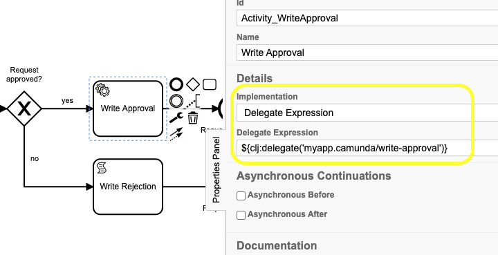
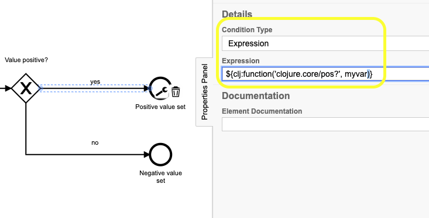

# camunda-clojure-plugin
A Camunda Process Engine Plugin to execute Clojure Functions as Delegates

[](https://clojars.org/com.lambdaschmiede/camunda-clojure-plugin)
[](https://app.circleci.com/pipelines/github/lambdaschmiede/camunda-clojure-plugin)

## Why do we need this?
While Camunda is tightly integrated with Java, using it with Clojure could be more elegant. If we want to call Clojure code as a Delegate, we need to create and compile a Java class from Clojure, so that it can be found by Camunda via the classloader. This does not go well with the REPL development flow. This project is an approach to call pure Clojure functions from Camunda process instances, without having to extend BPMN or Camunda itself.

## How does it work?
This Process Engine plugin registers a `org.camunda.bpm.engine.impl.javax.el.FunctionMapper` which can be referred to as a `DelegateExpression` from the BPMN file. It provides the UEL function `clj:delegate`, which accepts a string parameter, which can point to any Clojure function accepting a single parameter. This parameter passed will be an instance from Camundas `DelegateExecution` class. As an example, the delegate expression `${clj:delegate('example.camunda/test-delegate')}` will call the function `test-delegate` in the namespace `example.camunda`, which might look like this:

```clojure
(defn test-delegate [execution]
  (do
    (println (str "The instance is " (.getProcessInstanceId execution)))
    (.setVariable execution "var-name" 2)))
```

This has the following benefits:
* No customizing of BPMN. The default Camunda modeler and Cockpit just work
* No customizing of Camunda. No fork is needed, we can just make use of any Camunda version we like 
* No Java Interop Code. We can define our delegates as plain clojure functions
* Full REPL integration. We can adjust the Clojure delegate functions in the REPL on the fly and test them instantly with Camunda

## What can it do?

### Use Clojure functions via Delegate expression
If you want to call Java code from Camunda in a service task, there are two common ways: 
1. Configure the service task to be a Java Delegate and provide the fully qualified classname to a Java Delegate implementation
2. Configure the service task to be a Delegate Expression and provide a UEL-Expression which points to a Java Delegate implementation

Both cases work with Java Delegates, which are Java classes which implement the `org.camunda.bpm.engine.delegate.JavaDelegate` interface. This interface only has one method:

``` java
public interface JavaDelegate {
  
  void execute(DelegateExecution execution) throws Exception;

}
```

When the Process Engine handles this task, the method gets called and the process instance state is passed as a parameter of the type `DelegateExecution`. Developers can then extract variables from the execution or pass new ones into it (it is stateful!). As described above, geneating Java classes from Clojure in a way that the classloader can find them comes with a lot of overhead. We decided to make use of the Delegate Expressio mechanism to call Clojure Functions directly from Camunda. To achieve this, a service task needs to be configured as a 'Delegate Expression', and the EL function `clj:delegate` needs to point to a Clojure function which accepts a single parameter:



The function `write-approval` in the namespace `myapp.camunda` then might look like this:

``` clojure
(ns myapp.camunda
  (:require [myabb.db :refer [save-approval!]]))
  
(defn write-approval [execution]
  (let [{:strs requestee from to} (.getVariables execution)]
    (save-approval! requestee from to)))
```

### Use Clojure functions in EL-Expressions
Expressions are used in many different places in Camunda process definitions. One example is evaluating complex expressions to determine which way a Gateway should use. With the EL function `clj:function` we can provide a plain Clojure function and call it parameterized. The EL function accepts the Clojure function as the first parameter and all parameters as the following parameters:



The example shows that this really works with every function, even functions from `clojure.core`.

## How can it be configured?
When bootstrapping the Camunda engine in your Clojure program, you have to add the plugin class to the engine like this: 

``` clojure
(-> engine-config
    (.getProcessEnginePlugins)
    (.add (com.lambdaschmiede.camunda.clojure.ClojureProcessEnginePlugin.)))
```

The library is available on Clojars: `[com.lambdaschmiede/camunda-clojure-plugin "1.0"]`


## How stable is this? 
Currently this implementation is only used by lambdaschmiede itself, although are presenting it to customers using Camunda. It works in our projects, and we will keep maintaining it to guarantee a stable library for our own use. Stability and non-breaking changes is one of our main goals for this library.

## What's up next?
We'd like to also provide a similar way to create Execution Listeners and Task Listeners in the future or add some helper functions, if we have code in our own software that gets repeated a lot.
